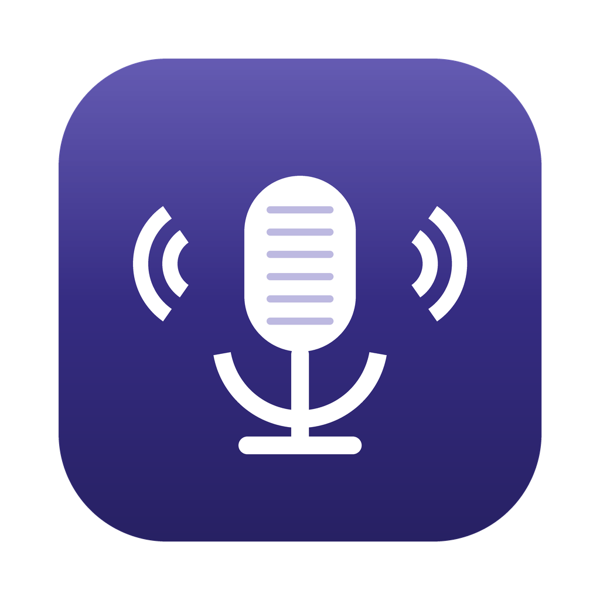

<div align="center">
  
  <h1>SHOWhisper</h1>
  <p><strong>Local, private voice dictation for macOS &amp; Windows.</strong></p>
  <p>Press a hotkey, speak, and your words are transcribed on-device with Whisper and pasted into whatever app you're in. No cloud, no account, nothing leaves your machine.</p>
</div>

---

## Features

- 🎙️ **Global hotkey dictation** — press <kbd>⌥</kbd> <kbd>Space</kbd> to start, press again to stop. The transcript is pasted at your cursor.
- 🔒 **Fully local & private** — transcription runs on-device via [Whisper](https://github.com/openai/whisper) (ONNX / [transformers.js](https://github.com/huggingface/transformers.js)). Audio never leaves your computer.
- 🪟 **Floating pill overlay** — a small, always-on-top capsule shows a live waveform while recording, progress while transcribing, and a ✓ when done. Drag it anywhere; its position is remembered.
- 🍎 **Menubar app** — lives in the tray/menubar, no dock clutter. Pick your model from the menu.
- ⚡ **Apple Silicon acceleration** — uses CoreML on macOS where available, with an automatic CPU fallback.
- 🧩 **Model choice** — from `tiny` (fast) to `large` (best quality), downloaded on demand and cached locally.

## How it works

```
⌥Space ─► global shortcut (main process)
               ├─ overlay pill: recording → transcribing → done
               ├─ Web Audio (renderer): capture + resample to 16 kHz mono PCM
               ├─ Whisper (transformers.js): PCM → text
               └─ clipboard + simulated ⌘V / Ctrl+V → paste into focused app
```

The <kbd>⌥</kbd> <kbd>Space</kbd> toggle is registered through Electron's built-in `globalShortcut` (the OS hot-key API), so it never sits in the system-wide input path and can't stall keyboard or mouse input.

## Requirements

- macOS 12+ (Apple Silicon or Intel) or Windows 10/11
- [Node.js](https://nodejs.org/) 18+ and npm (for building from source)

### Permissions (macOS)

On first launch macOS will ask for these permissions:

| Permission | Why | Where to grant |
|------------|-----|----------------|
| **Microphone** | recording your voice (required) | System Settings → Privacy & Security → Microphone |
| **Accessibility** | simulated paste of the transcript (optional: without it the text stays on the clipboard for a manual paste) | System Settings → Privacy & Security → Accessibility |

## Getting started (from source)

```bash
git clone https://github.com/adziendziolD/SHOWhisper.git
cd SHOWhisper
npm install
npm start
```

The first time you use a model it is downloaded (once) and cached under the app's user-data directory.

## Models

Choose in the tray menu. Larger models are more accurate (especially for German) but need more RAM and are slower.

| Model     | Size   | RAM     | Latency (M1) | Quality |
|-----------|--------|---------|--------------|---------|
| tiny      | 75 MB  | ~125 MB | ~0.5 s       | ⚠️      |
| base      | 150 MB | ~250 MB | ~1 s         | ✅      |
| small     | 450 MB | ~700 MB | ~2–3 s       | ✅✅    |
| medium    | 1.5 GB | ~2.5 GB | ~6–8 s       | ✅✅✅  |
| large     | 3 GB   | ~4.5 GB | ~15 s        | 🏆      |

Default: `small`. Models are loaded from the [`Xenova`](https://huggingface.co/Xenova) HuggingFace namespace by default (public, no token). You can switch the provider or add a HuggingFace read-token in **Settings** (the token is stored encrypted via the OS keychain).

> **Language:** German, English and French are selectable in **Settings**, and the whole UI localizes to the chosen language.

## Building installers

```bash
npm run build
```

Output lands in `dist/` (`.dmg` on macOS, NSIS `.exe` on Windows). Native modules are unpacked from the asar archive automatically (see `electron-builder.yml`).

> **After building, launch the packaged app once and run the full flow** (hotkey → model load → dictation → paste) — native modules only fully exercise in the packaged build, not just `npm start`.

### Code signing & notarization (macOS)

The build is **ad-hoc signed** (`mac.identity: "-"` in `electron-builder.yml`), which needs no Apple Developer account. This is what keeps Apple Silicon from rejecting the app with the hard "app is damaged" error. It is **not** notarized, so on first launch Gatekeeper still shows "SHOWhisper cannot be verified". Recipients open it once via:

- **right-click → Open** → *Open* in the dialog, or
- **System Settings → Privacy & Security → Open Anyway**, or
- `xattr -cr /Applications/SHOWhisper.app` in the Terminal.

After that first confirmation it launches normally.

For fully frictionless opening (no prompt at all) you need an [Apple Developer Program](https://developer.apple.com/programs/) membership and a *Developer ID Application* certificate, then set in `electron-builder.yml`:

```yaml
mac:
  identity: "Developer ID Application: Your Name (TEAMID)"
  hardenedRuntime: true
  notarize: true   # needs APPLE_ID / APPLE_APP_SPECIFIC_PASSWORD / APPLE_TEAM_ID env vars
```

## Development

```bash
npm run dev     # electron with NODE_ENV=development + devtools + verbose logs
npm run lint    # eslint
```

Verbose per-token / PCM diagnostics and transcript logging are only emitted in development mode — production builds keep logs minimal and never log the recognized text.

## Roadmap

- Auto-update via `electron-updater`
- Transcription history
- More languages / auto-detect
- Custom hotkey

## Tech stack

Electron (built-in `globalShortcut` for the hotkey) · [@huggingface/transformers](https://github.com/huggingface/transformers.js) (Whisper via ONNX) · [@nut-tree-fork/nut-js](https://github.com/nut-tree/nut.js) (paste simulation) · electron-store · electron-builder

## License

[MIT](LICENSE) © Adziendz
